# Video Games Intelligent Assistant

A conversational AI assistant specialized in video games information, built with advanced prompt engineering, multi-API integration, and comprehensive hallucination detection. The system provides accurate, context-aware responses about games, developers, platforms, and gaming culture.

## Project Overview

This project demonstrates a production-ready conversational AI system that:
- Integrates with 4 external APIs (RAWG, IGDB, Steam, Wikipedia)
- Implements advanced hallucination detection and mitigation
- Maintains conversational context across multi-turn interactions
- Provides both CLI (required) and Web UI (optional) interfaces
- Uses chain-of-thought reasoning for complex queries
- Enforces domain boundaries to prevent off-topic responses

> 📸 **Screenshots & Videos**: All demonstration screenshots and videos are included in the `screenshots/` folder. See the [Screenshots & Demonstrations](#screenshots--demonstrations) section below.

---

## Quick Start

### Prerequisites
- Node.js 18+
- MongoDB (via Docker Compose)
- GROQ_API_KEY (required)
- Optional: RAWG_API_KEY, IGDB credentials, STEAM_API_KEY

### Installation & Run

**Backend:**
```bash
cd backend
npm install
# Set up .env file with API keys
npm run dev
```

**Frontend:**
```bash
cd frontend
npm install
npm run dev
```

**CLI:**
```bash
cd backend
npm run cli
```

See [How to Run](#how-to-run) section for detailed setup instructions.

---

## Key Features Demonstrated

### 1. ✅ Conversation-Oriented Design

#### Assistant Purpose
- **Domain**: Video Games
- **Query Types Handled**:
  - **Game Information**: "Tell me about The Witcher 3", "tell me about gta v"
  - **Developer/Publisher Queries**: "what games Santa Monic...", "who is the biggest Publisher"
  - **Platform Queries**: "What games are on PlaySt..."
  - **General Gaming Knowledge**: "what are the games types?"

#### Context & Continuity
- **Multi-turn Conversations**: The system maintains context across multiple messages
- **Follow-up Questions**: Users can ask follow-ups like "give me the list of Tencent Holdings games" after asking about publishers
- **Conversation History**: All conversations are saved and can be revisited

#### Interaction Flow
- Natural, conversational responses
- Clear, helpful answers with source attribution
- Professional yet friendly tone

---

### 2. ✅ Advanced Prompt Engineering

#### Prompt Crafting
- **System Prompts**: Carefully designed to ensure accuracy and prevent hallucinations
- **Domain Boundaries**: Explicit instructions to reject non-gaming queries (e.g., "give me recipe for mac an...")
- **Data Formatting**: API data is formatted for optimal LLM consumption

#### Multi-Step Reasoning
- **Chain-of-Thought**: Complex queries trigger step-by-step reasoning
- **Comparison Queries**: Multi-entity comparisons use structured reasoning
- **Example**: "who is the biggest Publisher" uses multi-step analysis

#### Control Strategies
- **Hallucination Prevention**: System prompts explicitly prevent making up information
- **Uncertainty Handling**: Instructions to admit when uncertain
- **Domain Boundary Enforcement**: Rejects out-of-domain queries

---

### 3. ✅ Technical Implementation

#### Programming Language
- **Backend**: TypeScript/Node.js
- **Frontend**: React + TypeScript
- **Database**: MongoDB

#### LLM Model
- **Provider**: Groq API
- **Integration**: LangChain for conversation management
- **Models**: Default model for responses, lightweight model for validation

#### Interface
- ✅ **CLI**: Fully functional command-line interface (REQUIRED)
- ✅ **Web UI**: Modern React interface with ChatGPT-like sidebar (OPTIONAL but ENCOURAGED)

---

### 4. ✅ External Data Integration

#### API Connections (4 APIs - Exceeds Requirement)
1. **RAWG.io**: Game details, reviews, ratings, screenshots
2. **IGDB**: Developers, publishers, platforms, game data
3. **Steam Web API**: Prices, player counts, reviews
4. **Wikipedia**: General gaming knowledge

#### Data Fusion
- API data is formatted and passed to LLM in system prompts
- LLM synthesizes API data with general knowledge
- Responses clearly indicate data sources

#### Decision Logic
- **Intent-Based Routing**: Different APIs for different query types
  - Game queries → RAWG (primary)
  - Developer queries → IGDB (primary)
  - Platform queries → IGDB (primary)
  - Price queries → Steam (primary)
  - General queries → Wikipedia (primary)

---

### 5. ✅ Hallucination Detection & Management

#### Detection Methods
- **Fact Checking**: Validates claims against API data
- **Game Name Validation**: Checks if games mentioned are in API response
- **Price/Rating Validation**: Verifies numerical data
- **Confidence Scoring**: Overall confidence assessment

#### Mitigation Strategies
- **Accept**: High confidence, all facts verified
- **Flag**: Medium confidence, add disclaimers
- **Correct**: Low confidence, regenerate with corrections
- **Re-query**: Very low confidence, suggest re-querying

#### Validation Flow
- Automatic validation on all API-backed responses
- Confidence levels: HIGH, MEDIUM, LOW
- Unverified claims are flagged
- Disclaimers added when needed

---

## Example Conversations

### Example 1: Game Information Query
**User**: "Tell me about The Witcher 3"
- **Intent**: Game
- **API Used**: RAWG/IGDB
- **Result**: Detailed game information with verified data
- **Validation**: HIGH confidence
- **Screenshot**: [See Example 1 below](#example-1-game-information-query)

**User**: "Tell me about GTA V"
- **Intent**: Game
- **API Used**: RAWG/IGDB
- **Result**: Comprehensive game details
- **Screenshot**: [See Example 1 below](#example-1-game-information-query)

### Example 2: Developer Query
**User**: "what games Santa Monica Studio created"
- **Intent**: Developer
- **API Used**: IGDB
- **Result**: List of games developed by Santa Monica Studio
- **Validation**: Games verified against API data
- **Screenshot**: [See Example 2 below](#example-2-developer-query)

### Example 3: Platform Query
**User**: "What games are on PlayStation 5"
- **Intent**: Platform
- **API Used**: IGDB
- **Result**: Platform-specific game list
- **Validation**: Platform data verified
- **Screenshot**: [See Example 3 below](#example-3-platform-query)

### Example 4: Publisher Query with Follow-up
**User**: "who is the biggest publisher in the industry"
- **Intent**: Publisher/General
- **API Used**: Wikipedia/IGDB
- **Result**: Information about major publishers
- **Multi-turn**: Includes follow-up questions showing context preservation
- **Screenshot**: [See Example 4 below](#example-4-publisher-query-multi-turn-conversation)

### Example 5: Domain Boundary Enforcement
**User**: "give me recipe for mac and cheese"
- **Intent**: Detected as non-gaming
- **Result**: System politely declines and redirects to gaming topics
- **Validation**: Domain boundary working correctly
- **Screenshot**: [See Example 5 below](#example-5-domain-boundary-enforcement)

### Example 6: General Gaming Knowledge
**User**: "what are the games types?"
- **Intent**: General
- **API Used**: Wikipedia (if needed)
- **Result**: Information about game genres/types
- **Validation**: General knowledge, medium confidence
- **Screenshot**: [See Example 6 below](#example-6-general-gaming-knowledge)

### Example 7: Price Query
**User**: "how much cyberpunk 2077 cost"
- **Intent**: Game (with price filter)
- **API Used**: Steam
- **Result**: Current price from Steam API
- **Validation**: Price verified against Steam data
- **Screenshot**: [See Example 7 below](#example-7-additional-query-examples)

---

## Conversation Management Features

### Multiple Conversations
- **Sidebar**: Lists all conversations with titles, message counts, and timestamps
- **New Chat**: Easy creation of new conversations
- **Switching**: Click any conversation to switch context
- **Deletion**: Conversations can be deleted

### Conversation Persistence
- All conversations saved to MongoDB
- Messages persist across sessions
- Conversation history fully maintained

---

## Technical Architecture

### Backend Structure
```
backend/
├── src/
│   ├── services/
│   │   ├── games/          # API services (RAWG, IGDB, Steam, Wikipedia)
│   │   ├── llm/             # LLM integration (Groq, LangChain)
│   │   ├── hallucination/   # Validation, fact-checking, mitigation
│   │   ├── prompts/         # System prompts, reasoning prompts
│   │   └── context/         # Conversation management
│   ├── controllers/         # API endpoints
│   ├── models/              # Database models
│   └── routes/              # Express routes
```

### Frontend Structure
```
frontend/
├── src/
│   ├── components/
│   │   ├── ChatInterface.tsx
│   │   ├── ConversationSidebar.tsx
│   │   ├── MessageList.tsx
│   │   └── MessageInput.tsx
│   └── services/
│       └── api.ts           # API client
```

---

## How to Run

### Prerequisites
- Node.js 18+
- MongoDB (via Docker Compose)
- API Keys (optional but recommended):
  - GROQ_API_KEY (required)
  - RAWG_API_KEY (optional)
  - IGDB_CLIENT_ID & IGDB_CLIENT_SECRET (optional)
  - STEAM_API_KEY (optional)

### Backend Setup
```bash
cd backend
npm install
# Set up .env file with required keys
npm run dev
```

### Frontend Setup
```bash
cd frontend
npm install
npm run dev
```

### CLI Usage
```bash
cd backend
npm run cli
```

---

## Validation & Hallucination Detection

### How It Works
1. **Response Generation**: LLM generates response with API data
2. **Fact Checking**: System validates:
   - Game names against API data
   - Prices against API data
   - Ratings against API data
   - Unverified claims detection
3. **Confidence Scoring**: Overall confidence assessment
4. **Mitigation**: If low confidence, adds disclaimers or corrects

### Example Validation Output
```
Confidence: HIGH | Valid: Yes
Summary: Response validated successfully with high confidence. 5 fact(s) verified.
```

---

## Screenshots & Demonstrations

### Main Interface
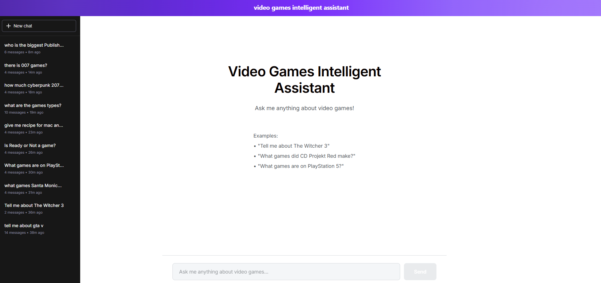
*The main chat interface showing the sidebar with multiple conversations and the current conversation view.*

---

### Example 1: Game Information Query
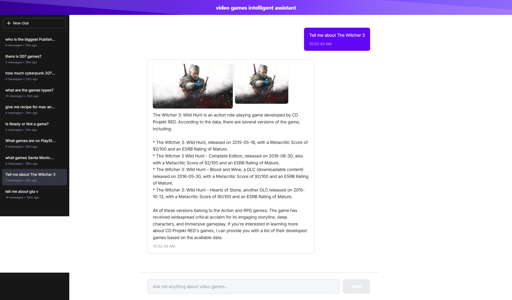
**User**: "Tell me about The Witcher 3"
- Shows detailed game information from API
- Demonstrates game query handling
- **Validation**: HIGH confidence

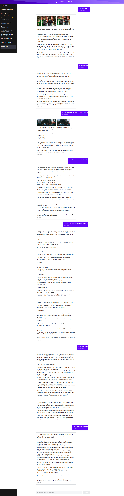
**User**: "Tell me about GTA V"
- Another example of game information query
- Shows comprehensive game details
- Demonstrates API data integration

---

### Example 2: Developer Query
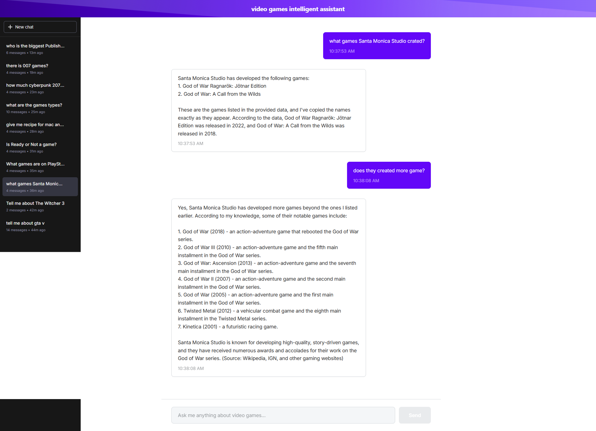
**User**: "what games Santa Monica Studio created"
- Shows game list from IGDB API
- Demonstrates developer query handling
- **Validation**: Games verified against API data

---

### Example 3: Platform Query
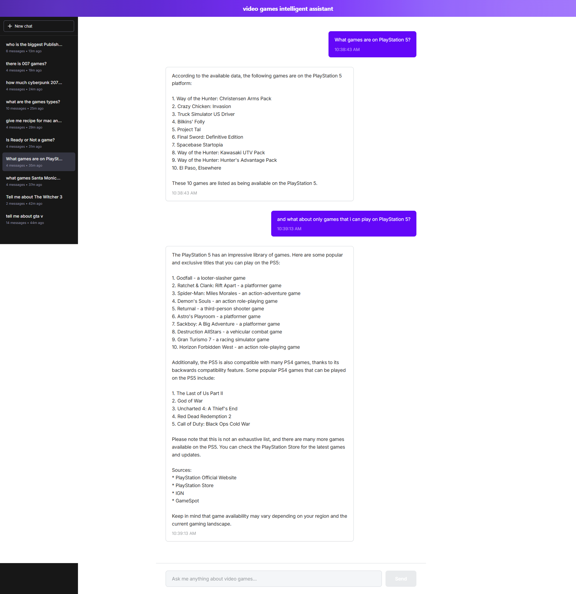
**User**: "What games are on PlayStation 5"
- Shows platform-specific games
- Demonstrates platform query handling
- **Validation**: Platform data verified

---

### Example 4: Publisher Query (Multi-Turn Conversation)
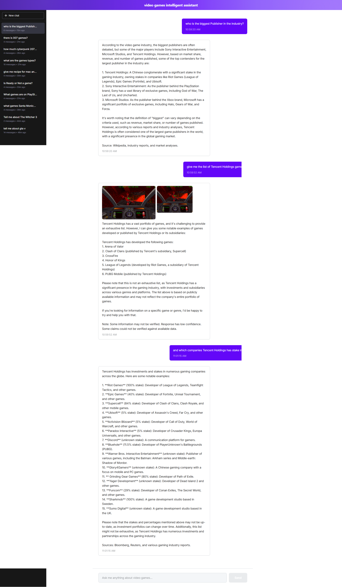
**User**: "who is the biggest publisher in the industry"
- Shows information about major publishers
- Uses Wikipedia/IGDB for publisher data
- Demonstrates comprehensive publisher analysis
- **Note**: This conversation includes follow-up questions showing multi-turn context preservation

---

### Example 5: Domain Boundary Enforcement
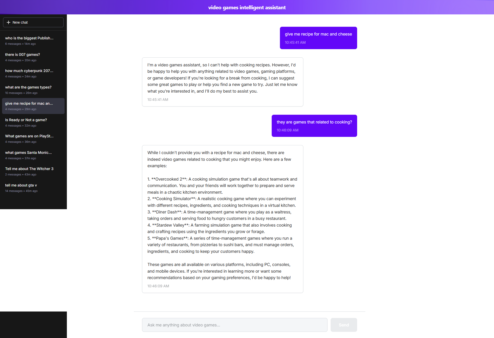
**User**: "give me recipe for mac and cheese"
- Shows system politely declining non-gaming queries
- Demonstrates domain boundary enforcement
- **Validation**: Correctly identified as non-gaming query
- System redirects user to gaming-related topics

---

### Example 7: Additional Query Examples

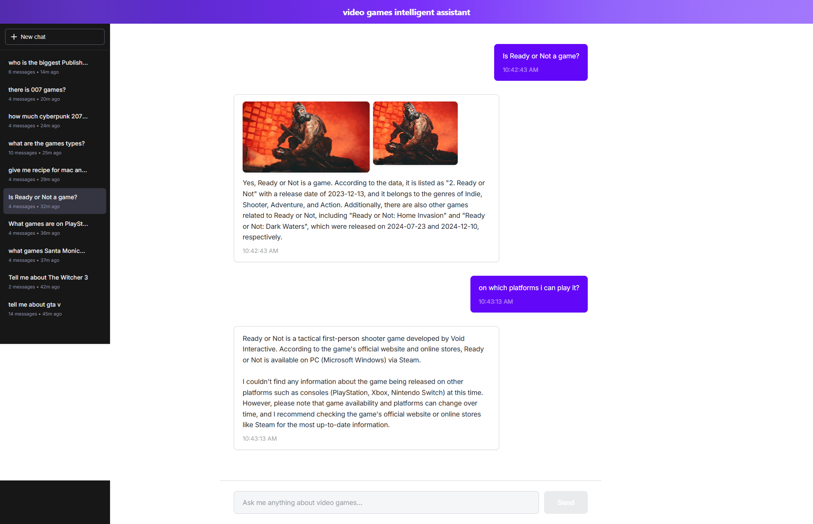
**User**: "Is Ready or Not a game?"
- Shows game verification query
- Demonstrates game identification
- Uses API data to confirm game existence


**User**: "there is 007 games"
- Shows game search/verification
- Demonstrates game discovery queries

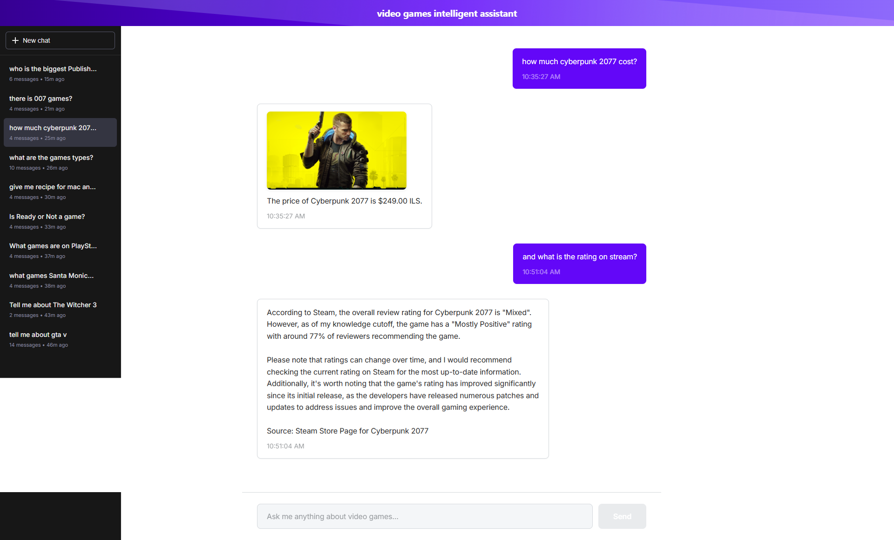
**User**: "how much cyberpunk 2077 cost"
- Shows price query handling
- Demonstrates Steam API integration
- **Validation**: Price verified against Steam API data

---

### Example 8: Conversation Management

*The main interface shows the conversation sidebar with multiple conversations visible. Each conversation can be:*
- Clicked to switch context
- Deleted with the delete button (hover to see delete icon)
- Created new with "New chat" button

All conversations are saved and persist across sessions. The sidebar shows:
- Conversation titles (auto-generated from first message)
- Message counts
- Last updated timestamps
- Active conversation highlighted

---

### Example 9: CLI Interface
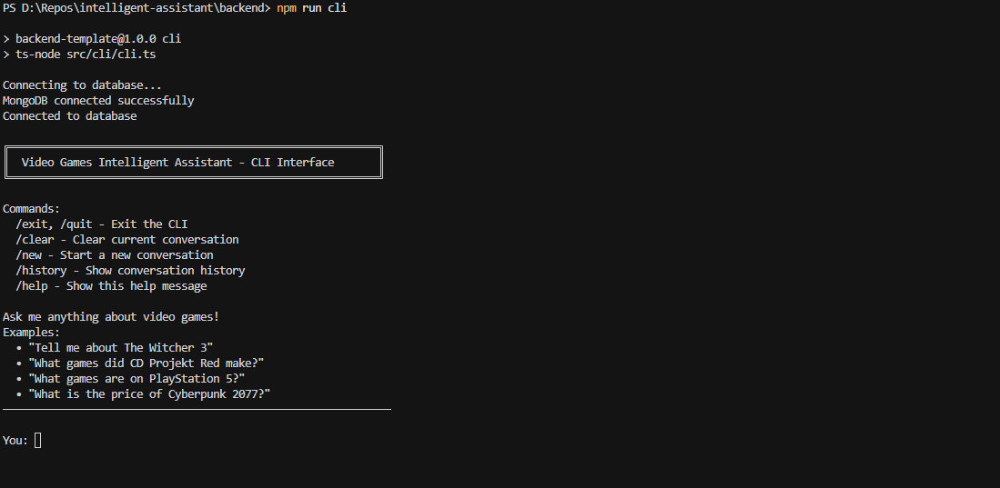
*CLI interface welcome message and help commands.*

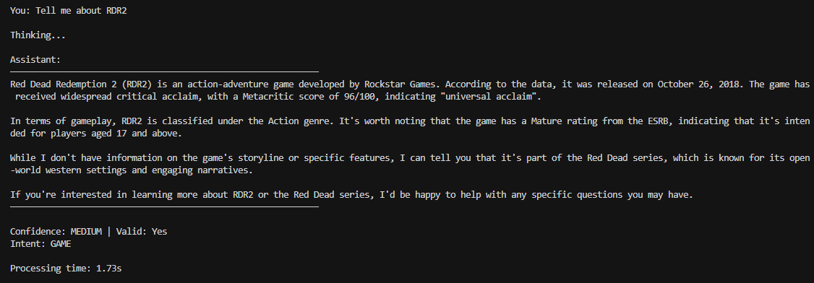
*CLI showing a query with validation output (Confidence: MEDIUM | Valid: Yes).*

---

### Example 10: Full Conversation Flow (Video Demo)
**Video Demo**: [Watch Complete System Demonstration](https://www.awesomescreenshot.com/video/46163128?key=58790b2396da0b0dc536a50ba07f2044)

*This video demonstrates:*
1. Starting a new conversation
2. Asking a game query
3. Follow-up questions maintaining context
4. Switching to another conversation
5. Showing validation in console
6. Demonstrating API integration
7. Conversation management features

---

## Key Achievements

✅ **Exceeds Requirements**:
- 4 APIs integrated (requirement: 2+)
- Both CLI and Web UI implemented
- Advanced hallucination detection
- Game name validation
- Domain boundary enforcement

✅ **Robust Implementation**:
- Comprehensive error handling
- Context management
- Conversation persistence
- Validation at multiple levels

✅ **User Experience**:
- ChatGPT-like interface
- Natural conversation flow
- Clear validation feedback
- Professional UI/UX